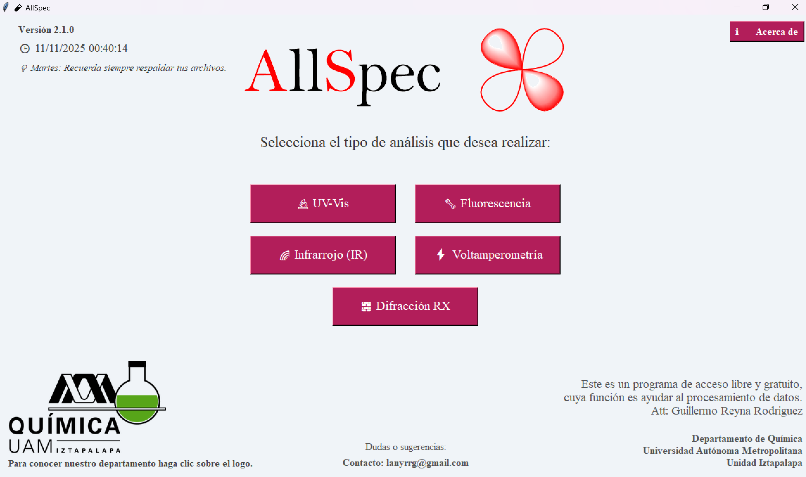
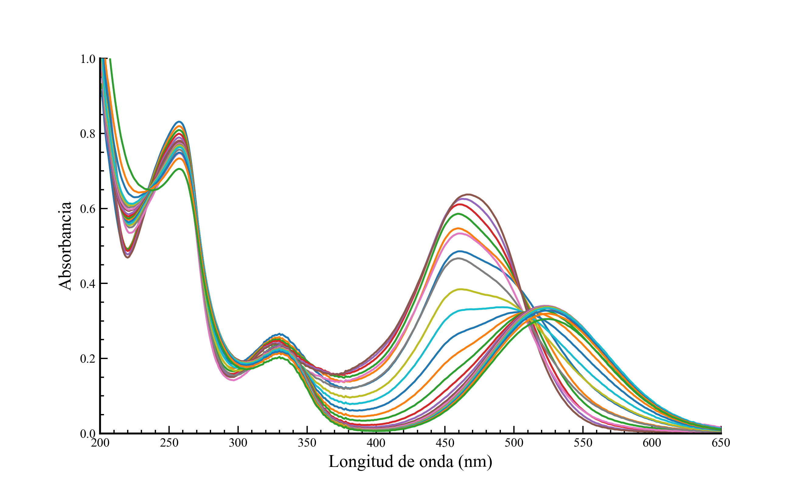
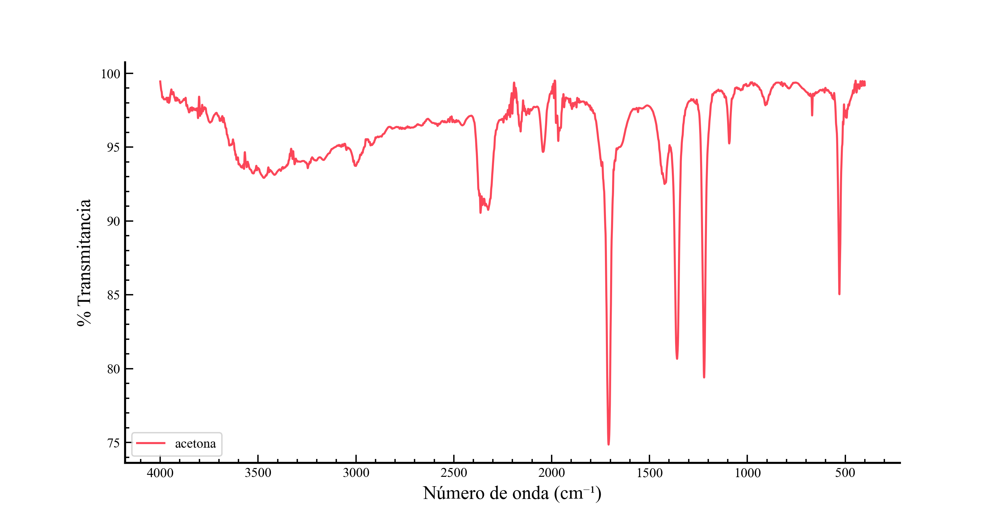
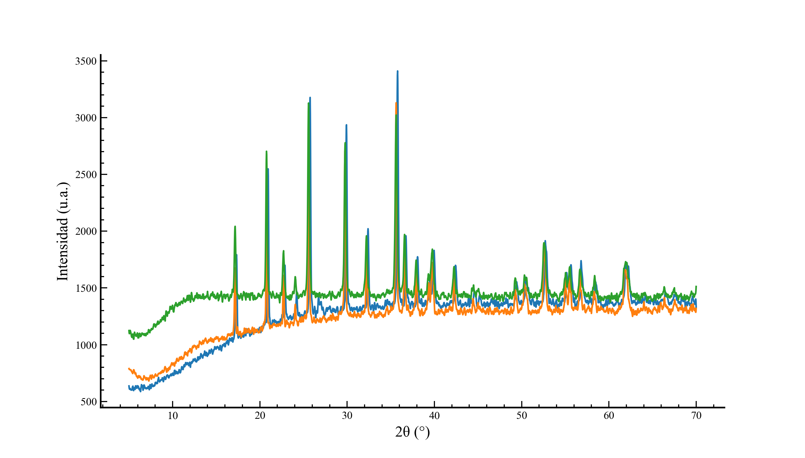
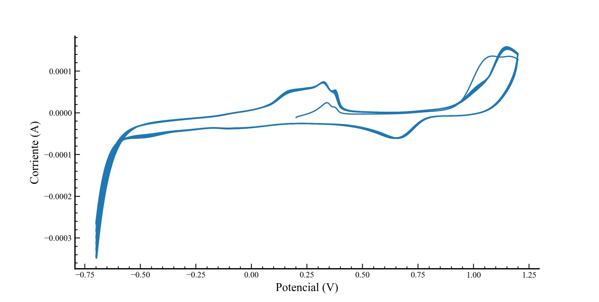

  
  <!-- Logo a la izquierda -->
  

    
  

  
  <!-- Botón de descarga a la derecha -->
  

    <a href="assets/downloads/AllSpec.pyw" download>
      <button style="background-color:#800020;color:white;padding:12px 25px;border:none;border-radius:5px;font-size:16px;cursor:pointer;">
        Descargar AllSpec.pyw
      </button>
    </a>
  

---
# 🧪 AllSpec

**AllSpec** es una plataforma desarrollada en **Python** que unifica en una sola interfaz gráfica diversos módulos para el procesamiento y visualización de datos experimentales de técnicas comunes en laboratorios de química, ya sean de docencia o investigación.  

Cada módulo está encapsulado en una clase independiente, siguiendo una arquitectura **modular**, lo que permite la fácil incorporación de nuevas técnicas y la actualización del código.  
La interfaz gráfica está implementada con **Tkinter**, garantizando compatibilidad multiplataforma y bajo consumo de recursos.

---
## La interfaz

  

---

## 🎯 Objetivos

- Automatizar el procesamiento simultáneo de múltiples archivos experimentales.  
- Permitir la visualización de múltiples datos al mismo tiempo.  
- Exportar resultados en formatos estándar (.csv) e imágenes (.jpg, .png).  
- Facilitar el acceso a estudiantes y académicos sin dependencia de software comercial.  
- Proporcionar un entorno extensible para futuros desarrollos científicos.

---

## 🔬 Técnicas soportadas

### UV-Vis
- Carga múltiple de archivos (.csv, .dat, .sp, .rls, .ascii).  
- Corrección con blanco (opcional).  
- Personalización de etiquetas y escalado manual de ejes.  
- Ocultamiento de leyendas.  
- Exportación conjunta de datos en .csv ordenado por longitud de onda.  
- Exportación de gráficos en .jpg y .png.

### Fluorescencia
- Carga múltiple de archivos (.sp únicamente).  
- Personalización de etiquetas y escalado manual de ejes.  
- Ocultamiento de leyendas.  
- Exportación conjunta de datos en .csv y gráficos en .jpg y .png.

### Infrarrojo (IR)
- Carga múltiple de espectros FTIR (.asc, .txt).  
- Edición de color por espectro.  
- Detección de picos y exportación de espectros combinados.  
- Personalización de etiquetas y escalado manual de ejes.  
- Exportación conjunta de datos en .csv y gráficos en .jpg.

### Difracción de Rayos X (DRX)
- Visualización de difractogramas (.txt, .xy, .dat).  
- Personalización de etiquetas y escalado manual de ejes.  
- Ocultamiento de leyendas.  
- Exportación conjunta de datos en .csv y gráficos en .jpg y .png.

### Electroquímica
- Procesamiento de técnicas como:
  - Voltamperometría lineal
  - Voltamperometría cíclica
  - Voltamperometría de disco rotatorio
  - Cronoamperometría
- Corrección con blanco.  
- Exportación de datos originales y corregidos (.csv).  
- Exportación de gráficos (.jpg).

---

## 📚 Librerías empleadas

| Librería           | Función |
|------------------|---------|
| Tkinter           | Desarrollo de la interfaz gráfica (GUI) |
| Matplotlib        | Generación y exportación de gráficos |
| NumPy             | Procesamiento numérico y manejo de arrays |
| SciPy             | Suavizados (Savitzky-Golay) y detección de picos |
| Pandas            | Manipulación y exportación de datos tabulados en .csv |
| os, glob          | Gestión y manipulación de archivos |
| tkinter.filedialog | Diálogos para selección y guardado de archivos |

> **Nota:** Todas las librerías son gratuitas, multiplataforma y con licencia permisiva, facilitando la distribución y mantenimiento de AllSpec.

---

## 💾 Exportación de resultados

- Permite exportar múltiples archivos cargados simultáneamente en **un solo archivo (.csv)**, facilitando análisis comparativos y evitando el proceso manual de unión.  
- Los datos se ordenan automáticamente por el eje X de cada técnica (ej. longitud de onda UV-Vis).  
- Exportación de gráficos de alta calidad (.jpg, .png) listos para reportes y presentaciones.

---

## ✅ Ventajas de AllSpec

- **Accesible:** No requiere licencias ni conexión a internet.  
- **Automatización:** Flujo completo desde carga hasta exportación.  
- **Multi-técnica:** Compatible con cinco técnicas experimentales esenciales.  
- **Extensible:** Arquitectura modular para incluir nuevas técnicas.  
- **Código abierto:** Permite manipulación, personalización y extensión.

---

AllSpec es una herramienta robusta y gratuita que **reduce significativamente el tiempo en tareas mecánicas del procesamiento experimental**, promoviendo la **reproducibilidad y trazabilidad**.  
Su enfoque **modular y educativo** la hace ideal para laboratorios académicos y estudiantes, eliminando la dependencia de software comercial.

---

## Ejemplos

  
  

  
  

---

## 🔗 Recursos

- [Manual de usuario (PDF)](assets/docs/Manual_AllSpec.pdf)  
- [Repositorio GitHub](https://github.com/Guillermo-RR/AllSpec)  
- [Sitio web GitHub Pages](https://guillermo-rr.github.io/AllSpec.github.io/)

---

## ⚖️ Licencia

AllSpec © 2025 **Guillermo Reyna Rodríguez**  
Distribuido bajo la [Licencia MIT](https://github.com/Guillermo-RR/AllSpec.github.io/blob/main/LICENSE).

El software puede ser utilizado, modificado y distribuido libremente, siempre que se reconozca la autoría original.

  

